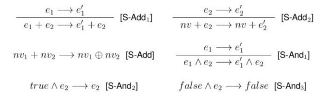

<h1 align="center">Linguagem de Programação baseada em Haskell</h1>

<p align="center">
  <a href="#dart-sobre">Sobre</a> &#xa0; | &#xa0; 
  <a href="#white_check_mark-como-usar">Como Usar</a> &#xa0; | &#xa0;
    <a href="#books-regras-da-linguagem">Regras da Linguagem</a> &#xa0; | &#xa0;
  <a href="https://github.com/Pedrinhonitz" target="_blank">Autor</a>
</p>

<br>

## :dart: Sobre ##

Este projeto consiste na implementação de um pequeno interpretador e verificador de tipos para uma linguagem de programação simples em Haskell. A linguagem definida permite operações básicas com números inteiros e booleanos, incluindo adição, operações lógicas, e construções condicionais.

## :white_check_mark: Como Usar ##
```bash
# Abrindo no Interpretador - GHCI
$ ghci Interpreter.hs
```
```haskell
-- Testando Instrução de Add -> Equivalente ao +
$ eval (Add (Num 1) (Add (Num 1) (Num 1)))
-- Output esperado: Num 3

-- Testando Instrução de And -> Equivalente ao &&
$ eval (And BTrue (And BFalse BFalse))
-- Output esperado: BFalse

-- Testando Instrução de If -> Equivalente ao if(){}else{}
$ eval (If (And BTrue BFalse) (Add (Num 1) (Num 1)) (Add (Num 2) (Num 2)) )
-- Output esperado: Num 4

-- Testando o TypeChecker
$ typecheck (If (And BTrue BFalse) (Add (Num 1) (Num 1)) (Add (Num 2) (Num 2)) )
-- Output esperado: If (And BTrue BFalse) (Add (Num 1) (Num 1)) (Add (Num 2) (Num 2))
```

## :books: Regras da Linguagem ##


#
Feito por <a href="https://github.com/Pedrinhonitz" target="_blank">Feito por Pedrinhonitz nas aulas de Linguagens de Programação - UFFS</a>

<a href="#top">Voltar ao topo</a>